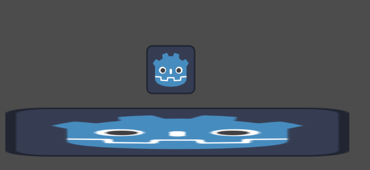
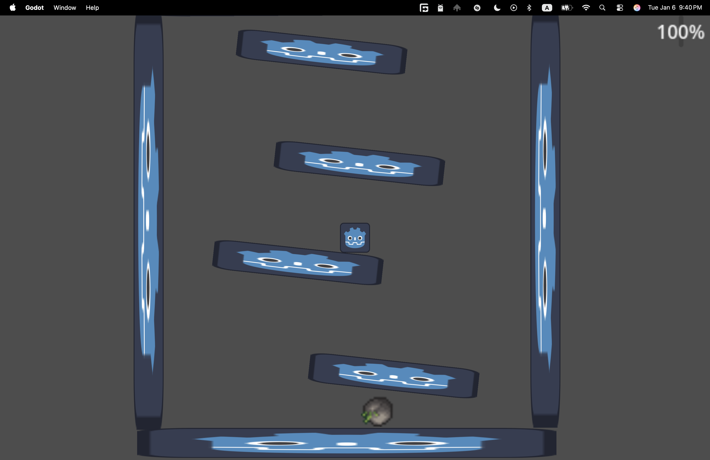

# Part 1: The Game
12.31.2025: 
I got a basic stage set up with some player movement. I spent too much time trying to get my player to be a rigidbody when there was a template with all the movement using CharacterBody2d :(

1.4.2026: 
Lots of progress was made today!
First, now the player can fire projectiles left and right. Secondly, a basic rolling enemy has been added. For the enemy and for the player a health system has been added. The player and the enemy both can die as a result of either the enemy colliding into the player or the player shooting enough projectiles at the enemy.
Todo:
    enemy spawner,
    Wave system,
    Time survived system,
    More enemy types,
    Platforms that are added as more enemies are killed,
[▶ Watch the video](JournalAsset/1.4.2026.mp4)

1.5.2026:
Today, I added some smaller things, the enemy spawner. In addition to this the enemies now can climb on top of each other to try to reach you. However the way that I did this causes them to speed up eventually. In addition to enemy related progress. I also added a system for adding platforms if you kill a certain amount of enemies.
I still need to add more platform types and replace the placeholder work.
[▶ Watch the video](JournalAsset/1.5.2026.mov)

1.6.2026
Today, there was not alot of work that was done :(. However I added a new flying enemy along with a roof so that the player will not be able to just jump outside the playing area. Also the projectile is now able to be aimed. I also added a health bar(I will probably change this to a texture based progress bar however).

