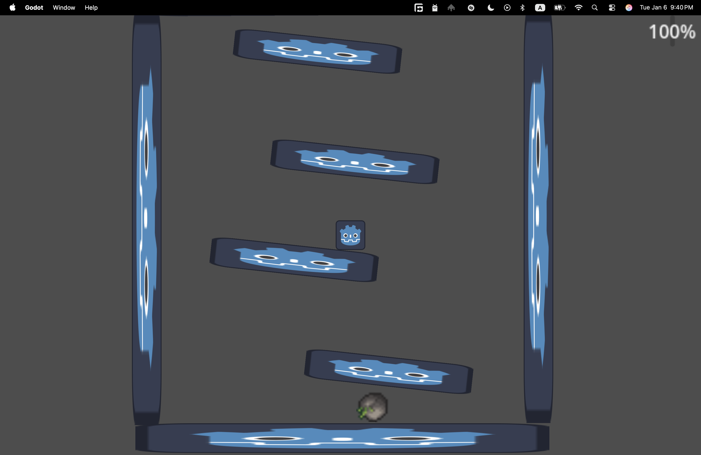
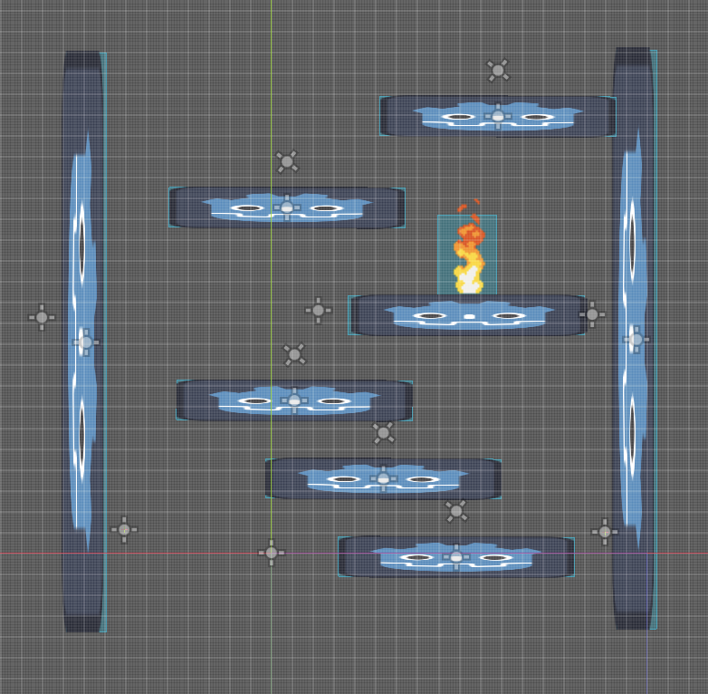
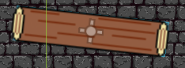
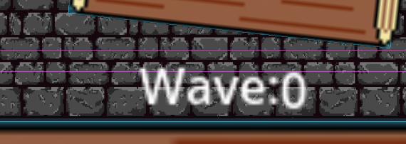
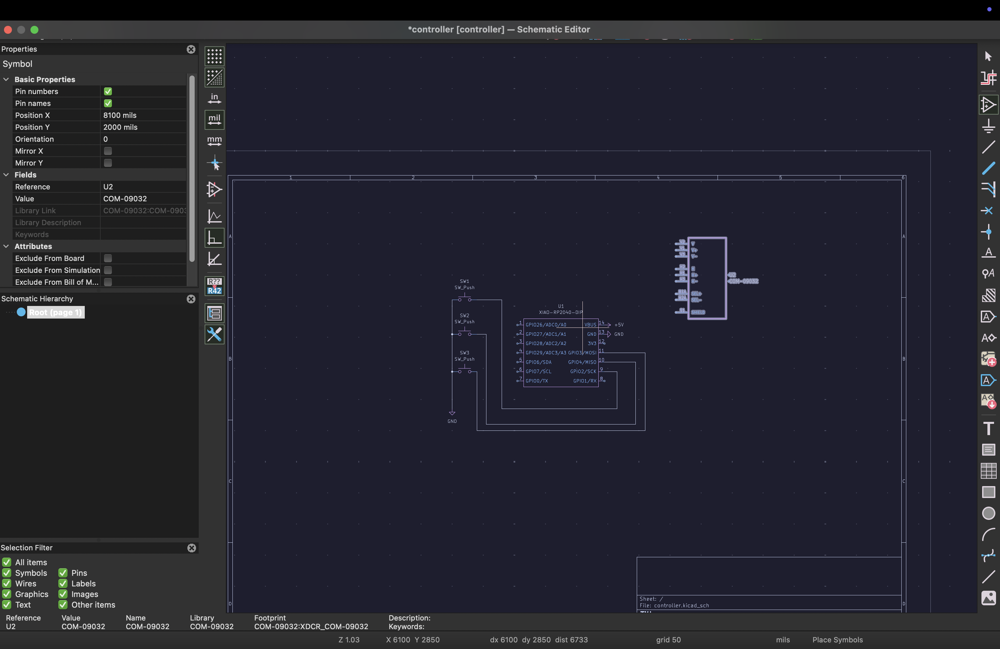
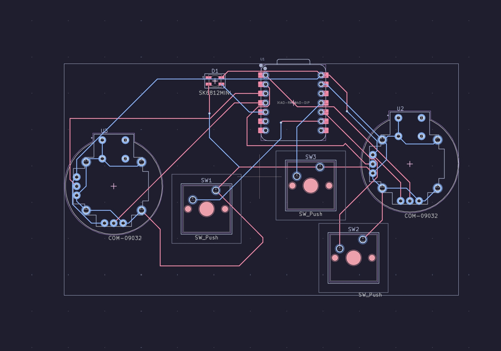
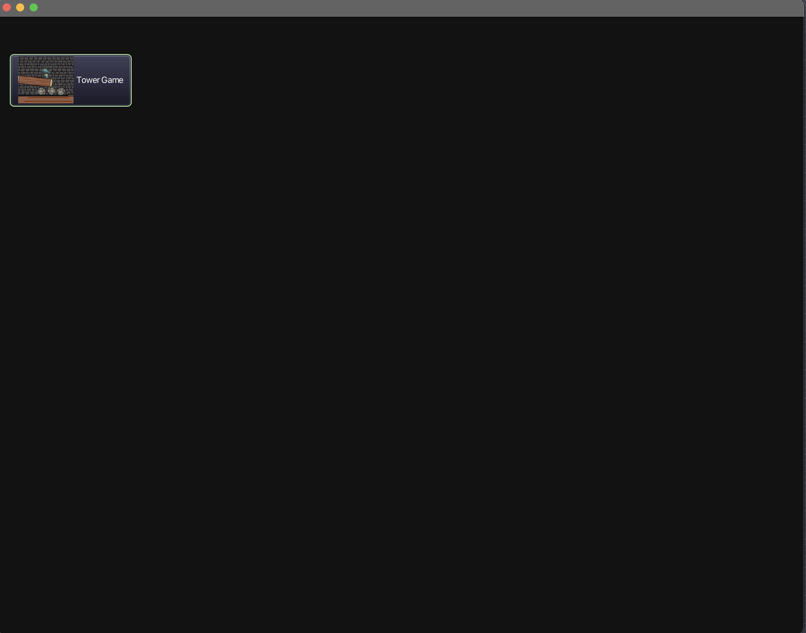

# Part 1: The Game
### 12.31.2025
I got a basic stage set up with some player movement. I spent too much time trying to get my player to be a rigidbody when there was a template with all the movement using CharacterBody2d :(

### 1.4.2026
Lots of progress was made today!
First, now the player can fire projectiles left and right. Secondly, a basic rolling enemy has been added. For the enemy and for the player a health system has been added. The player and the enemy both can die as a result of either the enemy colliding into the player or the player shooting enough projectiles at the enemy.
Todo:
    enemy spawner,
    Wave system,
    Time survived system,
    More enemy types,
    Platforms that are added as more enemies are killed,
[▶ Watch the video](JournalAsset/1.4.2026.mp4)

### 1.5.2026
Today, I added some smaller things, the enemy spawner. In addition to this the enemies now can climb on top of each other to try to reach you. However the way that I did this causes them to speed up eventually. In addition to enemy related progress. I also added a system for adding platforms if you kill a certain amount of enemies.
I still need to add more platform types and replace the placeholder work.
[▶ Watch the video](JournalAsset/1.5.2026.mov)

### 1.6.2026
Today, there was not alot of work that was done :(. However I added a new flying enemy along with a roof so that the player will not be able to just jump outside the playing area. Also the projectile is now able to be aimed. I also added a health bar(I will probably change this to a texture based progress bar however).

### 1.7.2026
Today, I mostly added more types of stair platforms being a platform with healing and a platform with a fire pillar that damages you.

.png)

### 1.8.2026
Today, I added more QOL like replacing the placeholder assets. I could not get much done today.

### 1.9.2026
I now have a wave system that spawns enemies in based on the amount of platforms there are. I also added a wave counter.

### 1.10.2026
Today there was lots of progress. 

First I added two new spells a burst spell[▶ Watch the video](JournalAsset/1.10.2026(Burst).mov) that pushes enemies away from you and a jump spell[▶ Watch the video](JournalAsset/1.10.2026(Jump).mov). In addition to this I also replaced the player sprite and made the player sprite able to look in different directions. For balance changes for my game, I changed the amount that the rock enemies can climb upon coming into contact into each other. Tomorrow I will try to add a main menu, a pause screen, and a death screen.

# Part 2: The controller

### 1.12.2026
Today, I got the buttons on the schematic set up I think I got the controller symbol in so I can start to wire that. I still have no idea on how I will add something that changes mouse inputs. I have a feeling that this will be an up hill battle. 

### 1.13.2026
Today I got the PCB design for the controller. I think that based on the tutorials online the joysticks should be set up correctly. Now I must make a case add add the firmware.

### 1.1.2026
Today, I worked on getting the firmware done. I think that most of it is finished however I have a feeling that it will not work and I will have to re-do it at some point. I also found out that in the schematic one of the sw_pushes was connected to ground on both terminals so I also fixed that. Next I need to install board and analogio.
.png)
.png)

# Part 3: The Launcher 
### 1.20.2026
Today, I worked on getting javaFX set up as I intend on using that for app development. I had lots of struggle with this  :(.

### 1.21.2026
Today, I managed to get the app launching functionality working. However I have to hard code where the executable is. I intend on having the app be able to scan for executables on external drives so that on my console I can have something similar to a disk insertion.

### 1.23.2026
Today I got the app to launch along side adding icon images to the button and theming the launcher app to a color scheme that I personally like. I unfortunately believe that this project will have to extend into week four because I do not think I can make enough progress to get all the features that I want in by Sunday. But for the next features I need to add something to automatically add executable files from external storage devices.

### 1.24.2026
